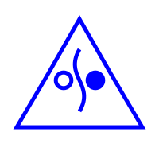

[link up a level../](../)

# About the Watershed Network

This is the symbol of the Network:

The triangle represents the geometric structure used to build useful symbols and icons in the Network.  The color blue represents water.  The open circle represents the sky from which rain falls, the curve represents the flow and the filled circle represents the sea to which all water tends to flow.  This symbol can be used to mark locations of various landmarks in the Network in the physical world.  

## Markers

Markers are physical objects in the real world which point to pages in the Network.  These are unobtrusive, aesthetically pleasing, and easily removed objects which have the Watershed Network symbol and the address of a page in the Network, in this case www.hammondbranch.org.  They can also have QR codes that allow one to scan a phone to get to the web page without having to key it in.  Don't mark up or vandalize existing things, don't cover existing signs, and don't put things up that are ugly, will bother people, and can't be removed if someone really wants to remove it.  A good way of making a marker is finding a stick in the area, shaving one side flat with a pocket knife, and writing the web address and symbol on with a blue paint pen, then tying the stick to a slat of an existing bridge, to a tree, a sign post, or part of a fence.  Markers can also be painted rocks. Use your imagination.  Don't litter or vandalize.

## Web pages

The default web page is like this one.  To edit any page, click on the edit icon which looks like this:

and then just edit the text and it is saved as you go.  If someone else is editing it, and you want to see their changes, you can hit the "reload" button.  The format here is a simple web language called "Markdown".  [See the Wikipedia page on it for some details](https://en.wikipedia.org/wiki/Markdown).

## Water quality studies and monitoring

As the network expands, it will eventually include both professionals in the water quality world both in the public and private sector as well as citizen scientists who monitor water daily and report on it.  This is part of the "self replicating and evolving" aspect: it is not included in this very early phase, and as the Network gathers the scale required to get the right people involved, it will evolve systems for this.  Are you a water quality expert or hobbyist who wants to find ways to disseminate information on water quality? Great! Let's figure this out.

## On the structure of this software(code)

This code is not like other code.  You can edit *all* of it here, on *this* page, in situ.  If you go to a page called [editor.php](editor.php) from *any* page in this network, you will be able to edit *any* of the various files that make up not only this page but all the various programs that make it run, including all the programs to access files, various helper programs, and even the editor program itself.  As with living things, all components of the code are intended to both self-replicate and self-edit.  Also as with living things none of this happens in a vacuum, and an active community of people who are hacking on this code is required for it to grow and evolve.  All code which can be is written in *client side* JavaScript.  PHP is used to access the local file system of the server--the reason for this is PHP works on pretty much all web servers with no need for any command line access ever.  

To make a new page which is a sub-page of an existing page, click on the "list" icon, which looks like this:

And then put the name of the new page in the "new page name" field, and click on the link.  Then just edit the new page as you would edit this one.

To make a totally new page, register a domain name for your new body of water, and upload replicator.php to the web directory.  Point a browser to that, and you've replicated this to that.

## The Global Vision

Water is life. Our bodies are mostly water.  Our lives revolve around water, our cities are built around water.  One of the central functions, arguably *the* central function of modern urban civilization is to manage water: clean it, move it around, and use it to best effect.  We envision a network of freely replicating web pages which reflect this reality.  We envision a world where our minds are constantly actively engaged with whatever watershed we are in at any given time.  This is a basic shift in worldview.  While right now we think first of all that we are in, say, "Laurel, in Howard County, in Maryland, in the USA, in North America", in the Watershed worldview, we replace that with "Hammond Branch, in Middle Patuxent, in Patuxent, in Chesapeake, in North Atlantic, in Atlantic Ocean."  That doesn't mean you're not also in Howard County, MD, but it's a shift of the most basic way of thinking about where we are and what we care about.  

Since all living things are based on water, it makes sense to launch a network which is attempting to imitate the basic structure of life ("organic media") as a network based entirely on the physical reality of water in our world.  Ultimately I imagine every creek, stream, river, bay or reservoir to have not only a node on this network but a vast subset of pages which link the various things that make them what they are up such as boat launches, storm sewer outlets, prominent rocks, swim beaches, etc. etc.  Ultimately every drop of water we interact with in our lives will be part of a living network of information linking it to every other drop.  This has the power to change the basic structure of how we interact with and think about the world around us.  In this age where our physical world is shaped by our choices and technology, this is a closed loop: to alter our perception of the reality of water is to alter the reality itself, and if this expands to the world it will change the very fabric of all life on Earth.  Join us, and expand!

